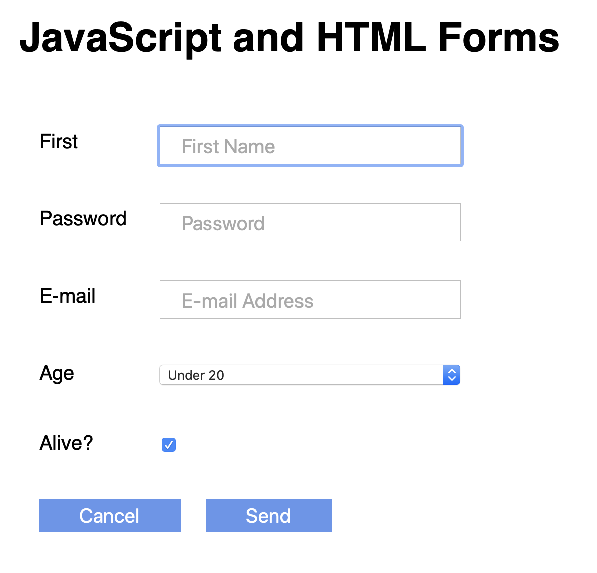

# HTML Forms

Working with HTML Forms and JavaScript. 

We use javascript to write the following functions 
- `init` (initialize the document)
- `reset` (reset the webpage by clearing all elements)
- `validate` (validate if all inputs fields are collectly filled out)
- `send` (allows us to submit the document)